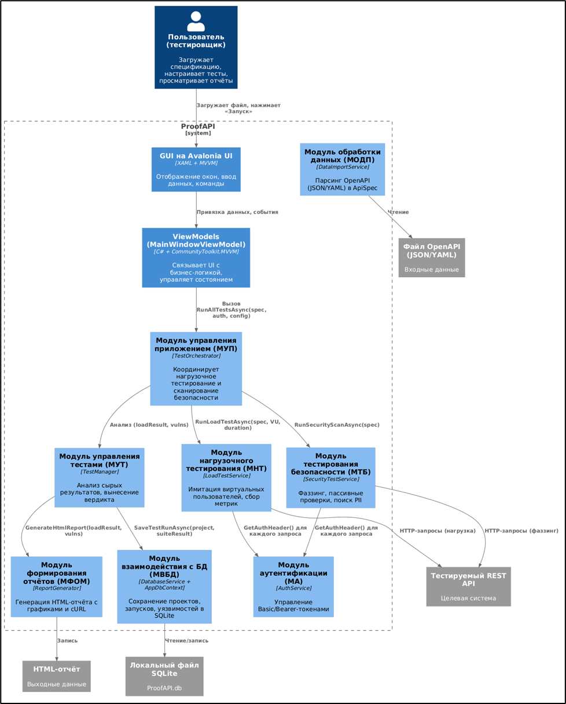

Архитектура ProofAPI формировалась исходя из необходимости обеспечить кроссплатформенность, масштабируемость тестовых нагрузок, возможность расширения набора проверок безопасности и долговременное хранение результатов с версионированием. В качестве основного архитектурного стиля выбрана многоуровневая архитектура с явным разделением ответственности и внедрением зависимостей. Архитектура программного обеспечения изображена на рисунке 1.

{width=978px height=1214px}

Это соответствует требованиям к надёжности и сопровождаемости инструмента, а также позволяет изолированно тестировать каждый модуль. Перечень разрабатываемых модулей представлен в таблице 2. 

Таблица 2 - Перечень разрабатываемых модулей

<table header="row">
<tr>
<td>

Наименование модуля

</td>
<td>

Назначение модуля

</td>
<td>

Файлы, реализующие модули

</td>
</tr>
<tr>
<td>

Модуль управления приложением (МУП)

</td>
<td>

Ядро системы, координация всех этапов работы ПО

</td>
<td>

TestOrchestrator.cs,

интерфейс ITestOrchestrator.cs

</td>
</tr>
<tr>
<td>

Модуль управления тестами (МУТ)

</td>
<td>

Анализ полученных от оркестратора «сырых» результатов, формирование итогового результата с вердиктом

</td>
<td>

TestManager.cs,

интерфейс ITestManager.cs

</td>
</tr>
<tr>
<td>

Модуль нагрузочного тестирования (МНТ)

</td>
<td>

Имитация одновременной работы множества виртуальных пользователей для оценки производительности API

</td>
<td>

LoadTestService.cs, интерфейс ILoadTestService.cs

</td>
</tr>
<tr>
<td>

Модуль тестирования безопасности (МТБ)

</td>
<td>

Поиск уязвимостей методами фаззинга, пассивный анализ заголовков безопасности и выявление утечек конфиденциальных данных в ответах API

</td>
<td>

SecurityTestService.cs, интерфейс ISecurityTestService.cs

</td>
</tr>
<tr>
<td>

Модуль обработки данных пользователя (МОДП)

</td>
<td>

Импорт и парсинг API-спецификаций в форматах OpenAPI 3.x (JSON/YAML) во внутреннюю модель

</td>
<td>

DataImportService.cs, интерфейс IDataImportService.cs

</td>
</tr>
<tr>
<td>

Модуль аутентификации (МА)

</td>
<td>

Управление аутентификационными заголовками для HTTP-запросов

</td>
<td>

AuthService.cs, интерфейс IAuthService.cs

</td>
</tr>
<tr>
<td>

Модуль взаимодействия с базой данных (МВБД)

</td>
<td>

Долговременное локальное хранение результатов тестов с возможностью версионирования и сравнения прогонов

</td>
<td>

DatabaseService.cs, интерфейс IDatabaseService.cs

</td>
</tr>
<tr>
<td>

Модуль формирования отчетных материалов (МФОМ)

</td>
<td>

Генерация итогового HTML-отчета, пригодного для просмотра и обмена

</td>
<td>

ReportGenerator.cs, интерфейс IReportGenerator.cs

 

</td>
</tr>
<tr>
<td>

Модуль логирования (МУ)

</td>
<td>

Диагностика и аудит работы приложения

</td>
<td>

Logger.cs

</td>
</tr>
</table>

В таблице 3 отображена взаимодействие модулей, здесь модуль логирования не отображается, так как он взаимодействует со всеми модулями.

Таблица 3 - Взаимодействие модулей

<table header="row">
<colgroup><col width="122"/><col width="72"/><col width="72"/><col width="72"/><col width="72"/><col width="85"/><col width="72"/><col width="91"/><col width="94"/></colgroup>
<tr>
<td>

Модуль\\ Использует

</td>
<td>

МУП

</td>
<td>

МУТ

</td>
<td>

МНТ

</td>
<td>

МТБ

</td>
<td>

МОДП

</td>
<td>

МА

</td>
<td>

МФОМ

</td>
<td>

МВБД

</td>
</tr>
<tr>
<td>

МУП

</td>
<td>

Х

</td>
<td>

Х

</td>
<td>

Х

</td>
<td>

 

</td>
<td>

 

</td>
<td>

 

</td>
<td>

Х

</td>
<td>

Х

</td>
</tr>
<tr>
<td>

МУТ

</td>
<td>

 

</td>
<td>

 

</td>
<td>

 

</td>
<td>

 

</td>
<td>

 

</td>
<td>

 

</td>
<td>

 

</td>
<td>

 

</td>
</tr>
<tr>
<td>

МНТ

</td>
<td>

 

</td>
<td>

 

</td>
<td>

 

</td>
<td>

 

</td>
<td>

 

</td>
<td>

Х

</td>
<td>

 

</td>
<td>

 

</td>
</tr>
<tr>
<td>

МТБ

</td>
<td>

 

</td>
<td>

 

</td>
<td>

 

</td>
<td>

 

</td>
<td>

 

</td>
<td>

Х

</td>
<td>

 

</td>
<td>

 

</td>
</tr>
<tr>
<td>

МОДП

</td>
<td>

 

</td>
<td>

 

</td>
<td>

 

</td>
<td>

 

</td>
<td>

 

</td>
<td>

 

</td>
<td>

 

</td>
<td>

 

</td>
</tr>
<tr>
<td>

МА

</td>
<td>

 

</td>
<td>

 

</td>
<td>

 

</td>
<td>

 

</td>
<td>

 

</td>
<td>

 

</td>
<td>

 

</td>
<td>

 

</td>
</tr>
<tr>
<td>

МФОМ

</td>
<td>

 

</td>
<td>

 

</td>
<td>

 

</td>
<td>

 

</td>
<td>

 

</td>
<td>

 

</td>
<td>

 

</td>
<td>

 

</td>
</tr>
<tr>
<td>

МВБД

</td>
<td>

 

</td>
<td>

 

</td>
<td>

 

</td>
<td>

 

</td>
<td>

 

</td>
<td>

 

</td>
<td>

 

</td>
<td>

 

</td>
</tr>
</table>
