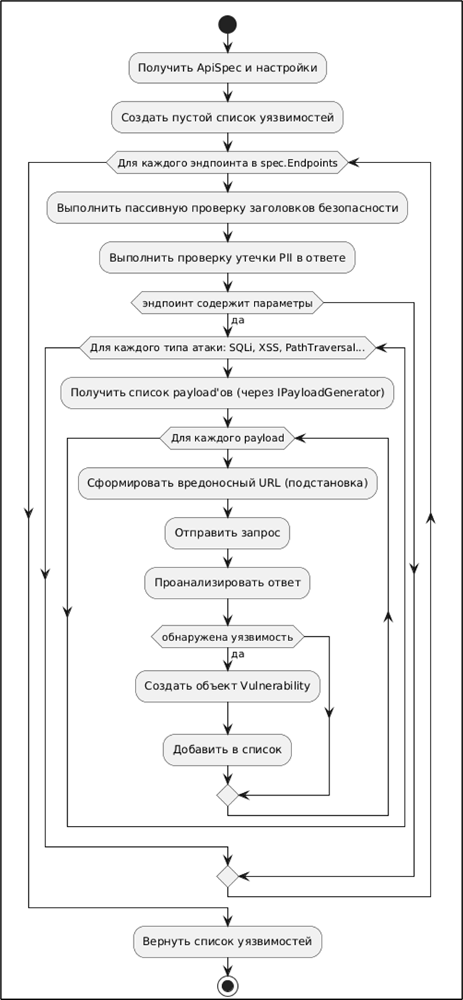
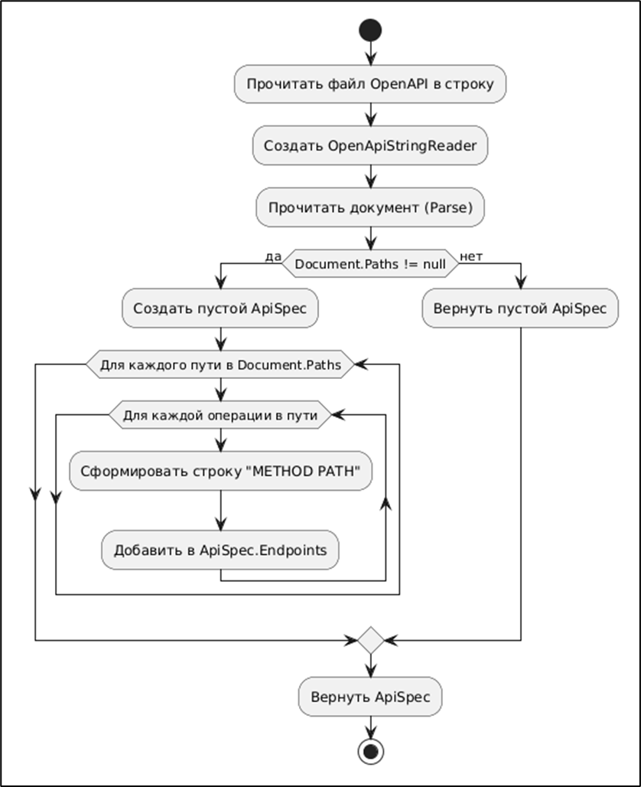

Программная система ProofAPI представляет собой приложение, компоненты которого взаимодействуют через чётко определённые интерфейсы. Центральным звеном, координирующим весь цикл тестирования, выступает модуль управления приложением (МУП), реализованный классом TestOrchestrator. Получив от пользовательского интерфейса объект ApiSpec, содержащий все эндпоинты, параметры и схемы данных тестируемого API, а также конфигурацию аутентификации и критерии проверок, оркестратор запускает параллельное выполнение нагрузочного тестирования и тестирования безопасности. Для этого он обращается к интерфейсам ILoadTestService и ISecurityTestService, которые после завершения возвращают соответственно объект LoadTestMetric и список Vulnerability. Код фрагмента класса TestOrchestrator представлен листингом 1.

Листинг 1 - Фрагмента кода класса TestOrchestrator

```c#
public class TestOrchestrator : ITestOrchestrator
{
private readonly ILoadTestService _load;
private readonly ISecurityTestService _security;
private readonly ITestManager _manager;
private readonly IDatabaseService _db;
private readonly IReportGenerator _report;
 
public TestOrchestrator(ILoadTestService load, ISecurityTestService security, ITestManager manager,
IDatabaseService db, IReportGenerator report)
{
_load = load;
_security = security;
_manager = manager;
_db = db;
_report = report;
}
 
public async Task<TestSuiteResult> RunAllTestsAsync(ApiSpec spec, int virtualUsers, int durationSeconds)
{
var startedAt = DateTime.UtcNow;
var loadTask = _load.RunLoadTestAsync(spec, virtualUsers, durationSeconds);
var securityTask = _security.RunSecurityScanAsync(spec);
 
await Task.WhenAll(loadTask, securityTask);
 
var loadResult = await loadTask;
var vulns = await securityTask;
 
var result = _manager.GenerateResult(loadResult, vulns, startedAt);
 
await _db.SaveTestRunAsync(spec.Title ?? "Unnamed", result);
await _report.GenerateHtmlReportAsync(result);
 
return result;
}
}
```

Далее оркестратор передаёт полученные сырые результаты модулю управления тестами (МУТ) – компоненту TestManager, который анализирует метрики производительности и состав обнаруженных уязвимостей, формирует общий вердикт (PASSED, WARNING или FAILED) и агрегирует данные в итоговый объект TestSuiteResult. После этого оркестратор последовательно вызывает модуль формирования отчётных материалов (МФОМ) для генерации HTML-отчёта и модуль взаимодействия с базой данных (МВБД) для сохранения результатов в локальное хранилище SQLite.

Модуль нагрузочного тестирования (МНТ) предназначен для оценки производительности API в условиях одновременной работы множества виртуальных пользователей. В классе LoadTestService реализован алгоритм, имитирующий поведение реальных клиентов. Основными входными параметрами являются число виртуальных пользователей, продолжительность теста, время разгона и набор эндпоинтов. Для каждого виртуального пользователя создаётся отдельная асинхронная задача, внутри которой в цикле до истечения заданного периода выполняются случайные запросы к тестируемому API. Каждый запрос обрабатывается через экземпляр HttpClient, при этом с помощью Stopwatch замеряется время отклика. По завершении всех виртуальных пользователей производится расчёт средней задержки, а также подсчёт общего числа запросов и ошибок. Для повышения точности нагрузочного профиля в сервис интегрирована поддержка разгона, когда виртуальный пользователь добавляются постепенно, что позволяет избежать одномоментного шока для тестируемой системы. Метрики возвращаются в виде структуры LoadTestMetric, которая затем сохраняется в JSON-поле базы данных и визуализируется в отчёте. Код фрагмента класса LoadTestService представлен в приложении А.

Модуль тестирования безопасности (МТБ) – наиболее сложный компонент системы, предназначенный для активного поиска уязвимостей. Класс SecurityTestService реализует два основных режима работы: пассивные проверки (анализ заголовков безопасности, поиск утечек конфиденциальных данных) и активный фаззинг с подстановкой вредоносных нагрузок в параметры запросов. Алгоритм работы модуля представлен на рисунке 2.

{width=642px height=1385px}

Алгоритм работы МТБ заключается в обходе всех эндпоинтов из ApiSpec, извлечении для каждого поддерживаемых HTTP-методов и параметров (query, path, headers, body), после чего для каждой комбинации «параметр – тип атаки» выполняется подстановка соответствующего пейлоада и отправка запроса \[5\]. Полученный ответ анализируется с помощью набора правил: для SQL-инъекций ищутся сообщения об ошибках СУБД или аномальные задержки, для XSS – проверяется неэкранированное присутствие внедрённого скрипта в теле ответа, для Path Traversal – появление содержимого файлов /etc/passwd или аналогичных маркеров. Параллельно с фаззингом выполняются пассивные проверки: отправляется базовый GET-запрос к корневому эндпоинту, и анализируются заголовки ответа и другие; отсутствие или неверное значение фиксируется как уязвимость низкой или средней критичности. Все найденные уязвимости унифицированно сохраняются как объекты Vulnerability с указанием типа, критичности, эндпоинта, вредоносной нагрузки и доказательства.

Для того чтобы тестирующие модули могли выполнять авторизованные запросы, в системе предусмотрен модуль аутентификации (МА). Он реализован классом AuthService. Интерфейс IAuthService содержит методы SetBasicAuth, SetBearerToken и GetAuthHeader; последний возвращает объект AuthenticationHeaderValue, который непосредственно добавляется в HttpRequestMessage перед отправкой.

Модуль обработки данных пользователя (МОДП) отвечает за импорт и парсинг файлов OpenAPI-спецификаций (версии 3.x) в форматах JSON и YAML. Класс DataImportService реализует следующий алгоритм: после загрузки содержимого файла определяется его формат, затем текст десериализуется в объект OpenApiDocument. Далее выполняется обход всех путей и для каждой операции извлекаются параметры (путь, запрос, заголовки, куки), схемы тел запросов, а также ожидаемые статусы ответов. На основе извлечённых схем для отсутствующих примеров генерируются шаблонные значения с помощью встроенного генератора примеров JSON Schema. Результатом работы является объект ApiSpec, который содержит структурированный список эндпоинтов со всей необходимой для тестирования информацией. Алгоритм работы модуля представлен на рисунке 3.

{width=838px height=1028px}

Важным служебным компонентом, обеспечивающим диагностику и аудит работы приложения, является модуль логирования. Его реализация – класс Logger – предоставляет централизованный механизм записи сообщений различного уровня (отладочные, информационные, предупреждения, ошибки) в файл и одновременно в поток трассировки .NET. Это позволяет разработчику и пользователю отслеживать ход выполнения тестов, фиксировать исключительные ситуации и анализировать причины сбоев. Все ключевые модули через внедрение зависимости получают ссылку на Logger.

После того как все тесты выполнены и результаты агрегированы, модуль формирования отчётных материалов (МФОМ), представленный классом ReportGenerator, преобразует полученные данные в человекочитаемый HTML-документ. Код фрагмента класса ReportGenerator представлен листингом 2. Алгоритм работы:

-  Принять объект TestSuiteResult;

-  Загрузить HTML-шаблон из встроенных ресурсов (или сгенерировать строку);

-  Заменить в шаблоне плейсхолдеры на фактические значения: вердикт, сводка, таблица уязвимостей;

-  Если есть метрики, добавить их в читаемом виде;

-  Сохранить полученный HTML в файл Report\_\{date}.html;

-  Вернуть путь к созданному файлу.

Листинг 2 - Фрагмент кода класса ReportGenerator

```c#
public class ReportGenerator : IReportGenerator
{
public async Task<string> GenerateHtmlReportAsync(TestSuiteResult result)
{
var sb = new StringBuilder();
sb.AppendLine("<html><body><h1>ProofAPI Test Report</h1>");
sb.AppendLine($"<h2>Verdict: {result.Verdict}</h2>");
sb.AppendLine("<h3>Load Test Metrics</h3>");
sb.AppendLine($"<p>Requests: {result.LoadMetric.TotalRequests}</p>");
sb.AppendLine($"<p>Avg time: {result.LoadMetric.AvgResponseTimeMs:F2} ms</p>");
sb.AppendLine("<h3>Vulnerabilities</h3><ul>");
foreach (var v in result.Vulnerabilities)
sb.AppendLine($"<li>{v.Type} at {v.Endpoint}: {v.Evidence}</li>");
sb.AppendLine("</ul></body></html>");
 
var fileName = $"Report_{DateTime.Now:yyyyMMddHHmmss}.html";
await File.WriteAllTextAsync(fileName, sb.ToString());
return fileName;
}
}
```

Модуль взаимодействия с базой данных (МВБД) обеспечивает долговременное хранение всех результатов с возможностью версионирования и последующего сравнения. Сервис DatabaseService работает поверх SQLite, используя Entity Framework Core для объектно-реляционного отображения. Схема базы данных включает таблицы Projects, TestRuns, Vulnerabilities и SecurityHeadersResults, связанные внешними ключами с каскадным удалением. Методы сервиса позволяют сохранить новый запуск теста со всеми вложенными данными в одной транзакции, получить историю прогонов для конкретного проекта, чтобы увидеть изменение количества уязвимостей и метрик со временем, а также загрузить полную детализацию любого запуска для повторной генерации отчёта. Такая архитектура хранения даёт возможность анализировать прогресс в обеспечении безопасности API и проводить сравнительный анализ версий.